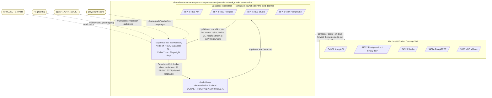

```mermaid
flowchart TB
  subgraph HOST[Mac host / Docker Desktop VM]
    direction TB
    PAPI[/54321 Kong API/]
    PPG[/54322 Postgres direct, binary TCP/]
    PSTUDIO[/54323 Studio/]
    PREST[/54324 PostgREST/]
    PVNC[/5900 VNC x11vnc/]
  end

  subgraph NETNS["shared network namespace — supabase-dev joins via network_mode: service:dind"]
    direction TB
    DEV["supabase-dev (workstation)<br/>Node 24 + Bun, Supabase CLI,<br/>Xvfb/x11vnc, Playwright deps"]
    DIND["dind sidecar<br/>docker:dind -> dockerd<br/>DOCKER_HOST=tcp://127.0.0.1:2375"]

    subgraph SB[Supabase local stack — containers launched by the dind daemon]
      direction TB
      SBAPI[/sb-* :54321 API/]
      SBPG[/sb-* :54322 Postgres/]
      SBSTUDIO[/sb-* :54323 Studio/]
      SBREST[/sb-* :54324 PostgREST/]
    end

    DEV -- "Supabase CLI: docker client -> dockerd @ 127.0.0.1:2375 (shared loopback)" --> DIND
    DIND -- "supabase start launches" --> SB
    SB -- "published ports bind into the shared netns, so the CLI reaches them at 127.0.0.1:5432x" --> DEV
  end

  NETNS -. "compose `ports:` on dind forward the netns ports out to the Mac" .-> HOST

  VPROJECTS{{"$PROJECTS_PATH"}} -. "/workspace" .-> DEV
  VGIT{{"~/.gitconfig"}} -. "/home/node/.gitconfig (ro)" .-> DEV
  VSSH{{"${SSH_AUTH_SOCK}"}} -. "/run/host-services/ssh-auth.sock" .-> DEV
  VPW([playwright-cache]) -. "/home/node/.cache/ms-playwright" .-> DEV

  classDef volumes fill:#fdfae4,stroke:#867a22
  class VPROJECTS,VGIT,VSSH,VPW volumes
```
